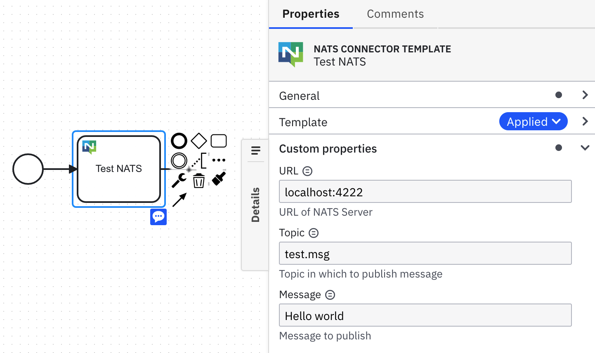

# NATS Connector Template

!!! Work in progress !!!

A starting point to build a NATS Connector to send messages to topics on NATS Servers. You'll need to provide the URL of the NATS Server, the topic you want to publish to, and the message you want to publish 
in the connector properties:

[More information on NATS can be found here](https://nats.io)

# TODO / Next steps

- Add stuff like authentication and outputs and additional functionality

